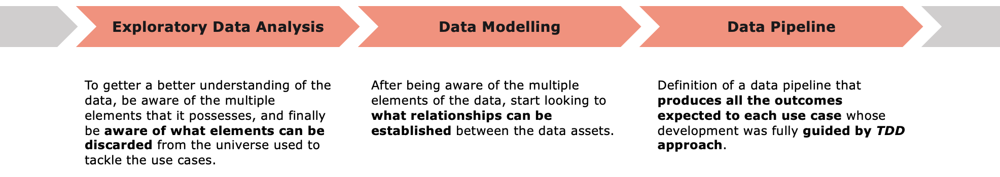
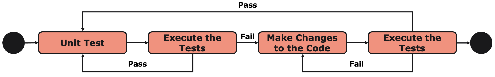
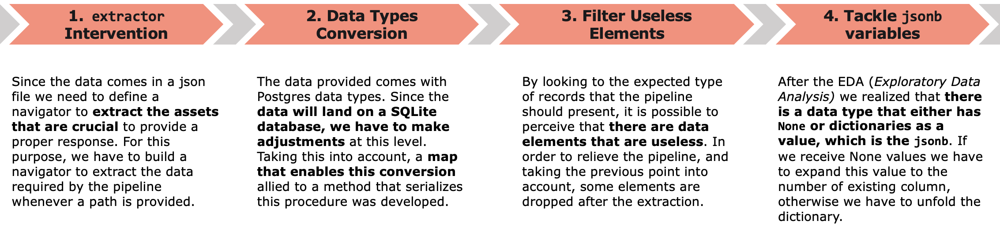
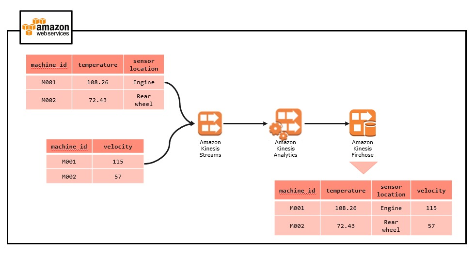

# **Data Engineer Code Challenge**

### **Versions**
[](https://shields.io/)

### **Coverage**
[](https://shields.io/)

## **1. Intro**
A Data Engineer is an IT professional whose main job is to prepare data for a set of operational and analytical use cases. They are responsible for **integrating**, **consolidating**, **cleansing**, and **structuring data**.

This code challenge gathers some of the aspects mentioned above and puts the candidate through these common actions that a Data Engineer must know.

In this particular challenge, it is intended that the candidate must be responsible for developing an ETL pipeline. For that purpose, we have a JSON file with multiple data assets, with some nested fields and others that need to be transformed. Another interesting aspect of the challenge is the way that the raw data is provided: we have a unique JSON file that possesses data relative to four distinct data dimensions (`event_v2_data`, `transaction`, `transaction_request`, and `payment_instrument_token_data`). The end line of this pipeline is the loading of the data assets manipulated until then to a serverless database (i.e. SQLite).

To get to the expected outcome, the development of the solution was divided into the following modules:



## **2. Project Tree**
The solution presented in this repository is divided into the following modules:

1. `/configs`
Configuration files that possess specifications relevant to the pipeline built. We are talking about files that establish a correspondence between data types (from Python or Postgres to SQLite) and also universal variables with whom the pipeline governs.

2. `/data`
A folder that tries to be a local emulation of a data lake's organization. Adapted to the dimension of this challenge, this folder possesses 3 layers/zones:

>> `/raw_zone`: this zone is where the data provided to address this challenge (the JSON file that contains the 4 data assets already mentioned - `wal.json`) is located. This data was not yet submitted to any modification or transformation, so we can look at it as being the "raw material";

>> `/curated_zone`: is the zone where the data assets will be placed after being submitted to all the required transformations. So it is clear that this zone will have 4 files corresponding to the 4 data assets that this code challenge aims for. These 4 dimensions will then be replicated on our serverless database;

>> `/consume zone`: is the dataset that is obtained after crossing the data from the 4 dimensions. It will be the data that is prepared to serve analytical use cases.

3. `docs`
Where the .md file that handles the presentation of the challenge is kept;

4. `images`
Images used on the documentation of this solution are saved in this folder;

5. `tdd_stage`
Where all the development was settled. TDD (*Test Driven Development*) practises were followed along the development stage, so we can look at this folder as the working area where all the methods and classes were not only developed, but tested.

## **3. TDD Pipeline**
In order to optimize the development process, guarantee the quality of the code produced, and avoid bugs, we have followed the principles of TDD (*Test Driven Development*).

This way, we spend most of the time developing modules of the solution (which can be quite time consuming), however, at the same time, we are assuring ourselves that at the production stage, after joining all the modules together, the probability of having problems or unexpected use cases is mitigated.

TDD bears its fundamentals in very simple principles and the next image tries to highlight them:



So the idea behind this concept is to before starting the development of a certain method or function, create test cases scenarios where the function must be capable of responding as expected. After the settlement of the test cases, we should then start the development stage. In case of failure on the set of tests, we must perform the refactoring of the code. It's also important to mention that **every function must be tested in more than on unitary test**, with multiple complexity levels, and in different scenarios.

## **4. Data Assets**

There are four data dimensions provided throughout the JSON file and they're following:
1. `event_v2_data` - that possesses all the transaction events;

```
sqlite> .schema event_v2_data
CREATE TABLE event_v2_data (event_id text, flow_id text, transaction_id text, transaction_lifecycle_event text, created_at text, source text, message text, decline_type null, decision_type text, decline_reason null, decline_reason_v2 null);
```

2. `transaction` - which gathers some specifications of the performed transactions;

```
sqlite> .schema transaction_dim
CREATE TABLE transaction_dim (transaction_id text, transaction_type text, processor_merchant_account_id text, amount integer, currency_code text);
```

3. `transaction_request` - details regarding the transaction requests;

```
sqlite> .schema transaction_request
CREATE TABLE transaction_request (flow_id text, payment_method text, token_id text);
```

4. `payment_instrument_token_data` - specifications on the payment details.

```
sqlite> .schema payment_instrument_token_data
CREATE TABLE payment_instrument_token_data (token_id text, payment_instrument_type text, vault_data jsonb);
```

## **5. Data Lifecycle**

Essentially, the pipeline developed submits the data to three simple stages: **Extract/Parsing**, **Transformations** (of nested fields and values, conversion of data types), and finally the **Loading of the "maturated" data** to a serverless database (SQLite).

The next image establishes a more profound analysis over the first two mentioned steps:



Absent from the previous picture is the Loading stage, which is accomplished by the definition of a [SQLite  python client](./tdd_stage/app/engine/python/sqlite/client.py) that can perform the following actions on the database already mentioned:

1. Prepares the data before the loading procedure;
2. Create Tables;
3. Loads the Data;
4. Performs SQL joins between two dimensions;
5. Drops unnecessary columns.

    ### **5.A Transformation Outcomes**

    To have an overview on the transformations defined, the following outcomes were collected by using breakpoints on the code:

    Examples:

     - `transaction`
    ```
    # before the transformations
    {'change': [{'kind': 'insert', 'schema': 'public', 'table': 'transaction', 'columnnames': ['transaction_id', 'processor_transaction_id', 'transaction_type', 'date', 'processor_merchant_account_id', 'merchant_reference', 'amount', 'currency_code', 'direction', 'status', 'risk_data', 'sale_transaction_id', 'created_at', 'updated_at', 'external_risk_data', 'network_transaction_id', 'payment_id', 'token_id', 'statement_descriptor'], 'columntypes': ['uuid', 'character varying(255)', 'transaction_type', 'timestamp without time zone', 'uuid', 'character varying(255)', 'integer', 'character(3)', 'transaction_direction', 'transaction_status', 'jsonb', 'uuid', 'timestamp without time zone', 'timestamp without time zone', 'jsonb', 'character varying(255)', 'uuid', 'character varying(36)', 'character varying(255)'], 'columnvalues': ['04a60a85-2254-4a2b-94d6-b4e764a524d5', None, 'SALE', '2021-06-03 07:47:50.013974', '776249f3-a050-579b-b525-55f232140c4b', 'mupzgivq', 58179, 'GBP', 'DEBIT', 'PENDING', None, None, '2021-06-03 07:47:50.013974', '2021-06-03 07:47:50.013974', None, None, 'dbc592b4-e82d-4c37-a92f-ae4d6e62c868', '1G2qvOyERACw5XtGwyMxF3wxNjIyNzA2NDU5', None]}]}

    # after the transformations
    % columns
    ['transaction_id', 'transaction_type', 'processor_merchant_account_id', 'amount', 'currency_code']
    
    % values[0]
    ['04a60a85-2254-4a2b-94d6-b4e764a524d5', 'SALE', '776249f3-a050-579b-b525-55f232140c4b', 58179, 'GBP']
    ```


     - `event_v2_data`
    ```
    # before the transformations
    {'change': [{'kind': 'insert', 'schema': 'public', 'table': 'event_v2_data', 'columnnames': ['event_id', 'event_sort_id', 'date', 'event_type', 'flow_id', 'transaction_id', 'updates', 'transaction_lifecycle_event', 'third_party_request', 'third_party_response', 'notification', 'created_at', 'notification_type', 'error_details', 'delivered', 'notification_config_id', 'connection_callback_request_id', 'transaction_request_id', 'old_event_id', 'payment_id', 'reason', 'connection_id'], 'columntypes': ['uuid', 'bigint', 'timestamp without time zone', 'event_type', 'uuid', 'uuid', 'jsonb', 'transaction_lifecycle_event_type', 'jsonb', 'jsonb', 'jsonb', 'timestamp without time zone', 'notification_type', 'jsonb', 'boolean', 'uuid', 'text', 'uuid', 'uuid', 'uuid', 'character varying(255)', 'character varying(255)'], 'columnvalues': ['25752189-663a-4b84-b596-71018e6e907d', 18952243, '2021-06-03 07:47:49.985438', 'TRANSACTION_LIFECYCLE_EVENT', '4c0ded8f-5c15-47eb-9a83-18cd9f63e817', '7d1eaa82-63b9-4651-b14b-1f49c395fcd3', None, 'AUTHORIZATION_FAILED', None, None, None, '2021-06-03 07:47:50.003493', None, '{"source": "ADYEN", "message": "HTTP Status Response - Unauthorized", "decline_type": null, "decision_type": "APPLICATION_ERROR", "decline_reason": null, "decline_reason_v2": null}', None, None, None, '51c60a73-3de3-4a86-a6c8-4d5cdf5dfe22', None, None, None, None]}]}

    # after the transformations
    % columns
    ['event_id', 'flow_id', 'transaction_id', 'transaction_lifecycle_event', 'created_at', 'source', 'message', 'decline_type', 'decision_type', 'decline_reason', 'decline_reason_v2']

    % values[0]
    ['25752189-663a-4b84-b596-71018e6e907d', '4c0ded8f-5c15-47eb-9a83-18cd9f63e817', '7d1eaa82-63b9-4651-b14b-1f49c395fcd3', 'AUTHORIZATION_FAILED', '2021-06-03 07:47:50.003493', 'ADYEN', 'HTTP Status Response - Unauthorized', None, 'APPLICATION_ERROR', None, None]
    ```


## **6. Production Placement**

A plausible production scenario for the challenge in question could be something like:


##### *Note:* we would use a cloud infrastructure automation tool like CloudFormation instantiating, this way, IaC (Infrastructure as Code) practises.

Multiple cloud streaming services to ease the capture and processing of the data. Transformations made by the Kinesis Streams Firehose, that handle ETL operations. 

After performing the transformations already mentioned and loading those results into a querying database, we could think on a visualization stage owned by AWS Quicksight, since we are discussing a prod architecture in AWS. 

## **7. Trigger the Pipeline**
To trigger the pipeline, it's only needed the following command:
```
>> python3 main.py
```
##### *Note:* take into consideration the deletion of the `metrics.db` content first.

It is important to mention that to perform the extractions to the data layers defined, we must take into account the following commands:
```
sqlite> .open [path_to_db_file]
sqlite> .headers on
sqlite> .mode csv
sqlite> .output [filename].csv
sqlite> [sql_query]
```

## **A. Results**
The resultant dimension obtained from running the pipeline described above is called `expected_dim` (that was extracted in the form of a [.csv file](./data/3_consume_zone/result.csv)). 

Regarding the bulletproof test, we can obtain it by considering the following command (performed on the `sqlite3` console):

```
sqlite> SELECT COUNT(*) FROM expected_dim;
529
```

## **B. Improvement Points**
Besides the fact that the developed pipeline can return the expected results, there are a couple of improvements that can be taken into consideration:

1. the TDD pipeline **should contemplate more test case scenarios** and with other levels of complexity and **also exceptions tests** (*i.e.*, a method that expects a list to be provided being tested against an input that does not possess a list);
2. there are **code optimizations** that could have been explored;
3. the `sqlite client` should be also **capable of extracting the data** to the different data layers in an automatic manner.


---

`Author`: João Nisa

`Last Updated`: 31 of January, 2022